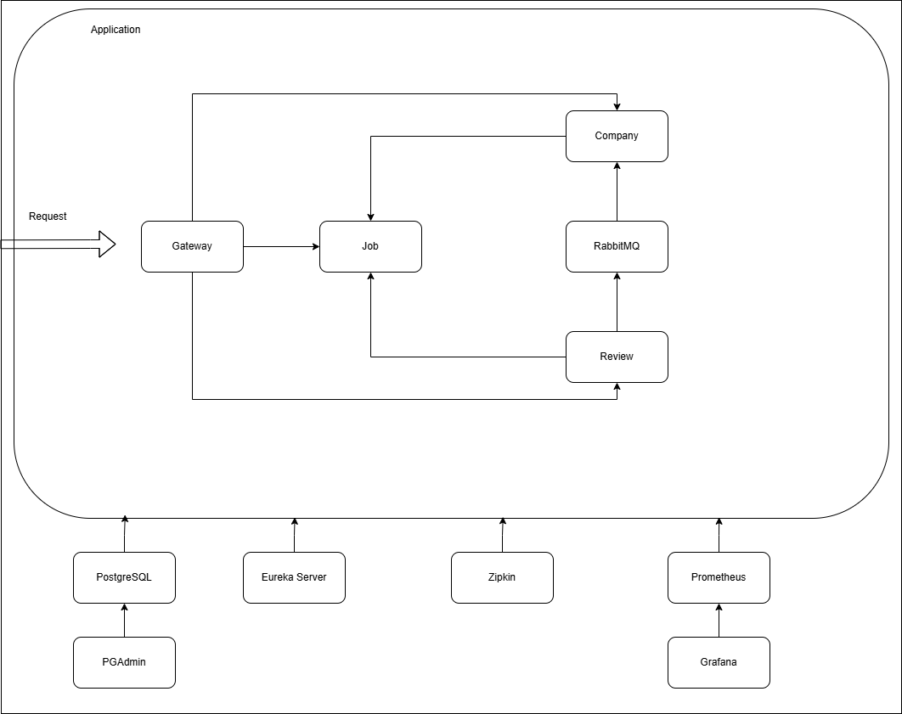

# Job Application

This project is a job-seeking web application inspired by popular employment platforms. 
It is built using a microservice architecture to ensure modularity, scalability, and ease of maintenance. 

## :classical_building: The Solution Architecture


## Used Dependencies

#### :toolbox: Core Framework
- **Spring Boot** – Microservice foundation
- **Spring Cloud** – Distributed system patterns

#### :file_cabinet: Database
- **PostgreSQL** – Relational database
- **Spring Data JPA** – ORM integration

#### :arrows_counterclockwise: Communication
- **Feign Client** – Inter-service HTTP calls
- **RabbitMQ** – Messaging queue

#### :bar_chart: Monitoring & Tracing
- **Spring Boot Actuator** – Application health and metrics endpoints
- **Micrometer** – Metrics instrumentation facade
- **Prometheus** – Metrics collection and alerting system
- **Grafana** – Visualization dashboard for metrics
- **Zipkin** – Distributed tracing system

#### :gear: Infrastructure
- **Eureka Server** – Service registry
- **Spring Cloud Gateway** – Routing and filtering
- **Docker** – Containerization

## ️ :hammer_and_wrench: How to Build and Run

This application is fully dockerized, making it easy to build, deploy, and scale across different environments. Follow the steps below to get started:

### Prerequisites

Before building the application, ensure you have the following installed:

- [Docker](https://www.docker.com/products/docker-desktop)
- [Docker Compose](https://docs.docker.com/compose/)

### Step 1: Run the Application

Start all services using:
```bash
docker compose up -d
```

### Step 2: Verify Everything is Running

check the status of all containers
```bash
docker ps
```